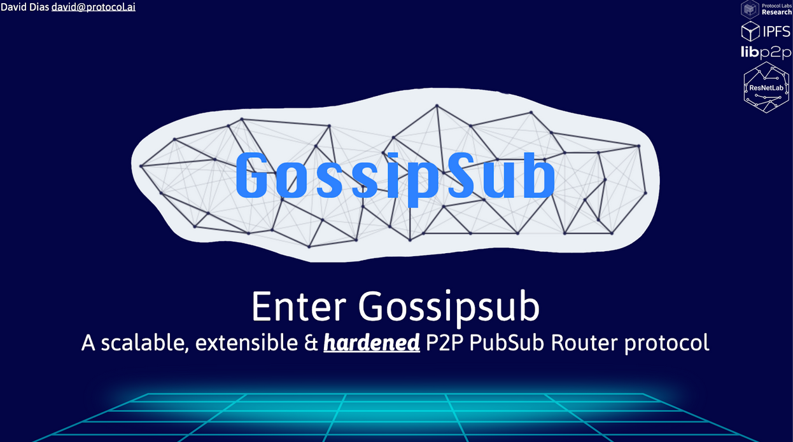

---

# Blog post title
title: "Gossipsub v1.1 at 'Open Tech Will Save Us' virtual event"

# Website post date
# format YYYY-MM-DD
date: 2020-04-17

# Publish from this date (defaults to date)
# publishDate: 2019-09-03

# For PL authors, use author folder name; for non-PL authors, write name as in paper within ""
authors:
  - david-dias

# If applicable
categories:
  - talks

# Zero or more of the areas in content/research/areas
research_areas:
  - distributed-systems

# Zero or more of the groups in content/research/groups (should match author membership)
research_groups:
  - resnetlab

# Not used
draft: false

---

ResNetLab was present at [“Open Tech Will Save Us”](https://matrix.org/open-tech-meetup) virtual event, a meetup organized by the Matrix.org team. This meetup was an online event where participants could watch a live stream provided by [Jitsi](https://jitsi.org) and ask questions to the speakers using the [Matrix protocol](https://matrix.org)  (likely using a client like [Riot](https://about.riot.im)).

Matrix is both a project and an ecosystem that focuses on providing secure and federated platform for all types of communication. We are big users of Matrix at Protocol Labs, both in terms of inspiration for our research from Matrix great innovations (e.g. [Olm](https://gitlab.matrix.org/matrix-org/olm/blob/master/docs/olm.md) and [MegaOlm](https://gitlab.matrix.org/matrix-org/olm/blob/master/docs/megolm.md) cryptographic ratchets) and as users, bridging the [IPFS](https://riot.im/app/#/group/+ipfs:matrix.org) and [libp2p](https://riot.im/app/#/group/+libp2p:matrix.org) IRC channels with Matrix.

David Dias delivered a talk on the recent updates on the Gossipsub protocol, one of the most scalable P2P PubSub solutions, now with additional security hardening features with the v1.1 release. In this talk, you can learn about:

- Motivation for P2P PubSub
- The background on libp2p PubSub and its evolution, from Floodsub to Gossipsub
- Gossipsub v1.0
- Gossipsub v1.1, the new release packed with security-hardening features
- The Gossipsub testing infrastructure

You can now access:

- the [recording](https://www.youtube.com/watch?v=APVp-20ATLk&feature=youtu.be&t=3612)
- the [slide deck](https://www.slideshare.net/DavidDias11/enter-gossipsub-a-scalable-extensible-hardened-p2p-pubsub-router-protocol)

## Q&A

You can watch the [Q&A portion of the recording](https://youtu.be/APVp-20ATLk?t=5427) or read below if you prefer a summary.

**Q: If one uses two different libp2p implementations, will they share the same network.**

A: By default, yes. We call the default network, the Main Network and this network is shared between libp2p and IPFS and other protocols that started relying on it. If you desire to have a disjoint network, you achieve it in a few ways:

- Isolate your nodes by firewall/iptables to not allow the nodes to connect to the outside world (the traditional way)
- Change the config of your libp2p/IPFS node to not use the default Bootstrapper nodes. If you don’t connect to the Bootstrappers or any of the other nodes in the Main network, your node will be unable to find the network by itself
- Use a libp2p-pnet. Essentially, with libp2p-pnet, you share a PSK (pre-shared key) with the nodes that you want on your disjoint network and once they find other nodes, they will always run a special handshake that only the nodes that have that PSK can complete. You can watch [Jacob Heun’s talk at the IPFS Dev Meetings](https://www.youtube.com/watch?v=fObld4alGag&feature=youtu.be&t=51) demoing this feature.

**Q: How much work is it to use Gossipsub / libp2p PubSub in an application?**

A: Virtually almost nothing! You can start a libp2p node with PubSub and from that you get two primitives: .Publish & .Subscribe. .Publish lets you publish a message on a topic of your choice, .Subscribe enables you to subscribe to any topic. Pedro Teixeira recorded a 10 min demo that shows [how to build an app with PubSub from scratch using JavaScript](https://www.youtube.com/watch?v=Nv_Teb--1zg).

**Q: How do the rules for the Message Validators get expressed?**

A: Today, these are simply expressed programmatically using a message handler pattern. We actually went a bit on mad science / sci-fi direction on this one ([watch the related passage](https://youtu.be/APVp-20ATLk?t=5679)).

**Q: How do you reconcile the initial goal of a real-time protocol vs. the eventual consistency of Gossip?**

A: Instead of making a decision for the user, what we do is provide as much power to the user as possible, providing recommendations on how to set the right parameters for the different types of interaction patterns and network scales.

**Q: Does Gossipsub have presence support?**

A: By default no, this would require to have been built by the application on top, establishing a link between the keys that identify the user to the keys that identify the nodes that the user uses.

We also recommend watching the other two talks and learn about:

- [How Jitsi scaled from 10s to 1000s of Servers](https://youtu.be/APVp-20ATLk?t=852) to provide an invaluable communications service when it was most needed during the COVID-19 outbreak
- [How Matrix.org figured out the UX to deploy full E2EE](https://youtu.be/APVp-20ATLk?t=6122) (end-to-end encryption) for all of its users

We really appreciate the invitation, it was a fun way to catch up and learn about some of the projects that inspire us and also, to see online the faces that we are used to seeing in so many of the in-person events.

Thank you and looking forward to the next one!
