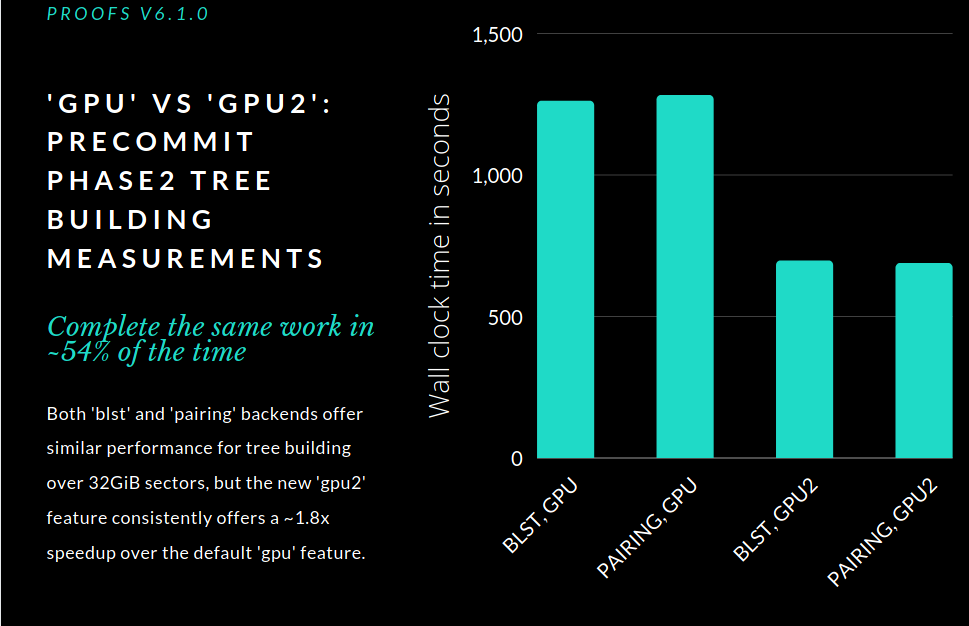
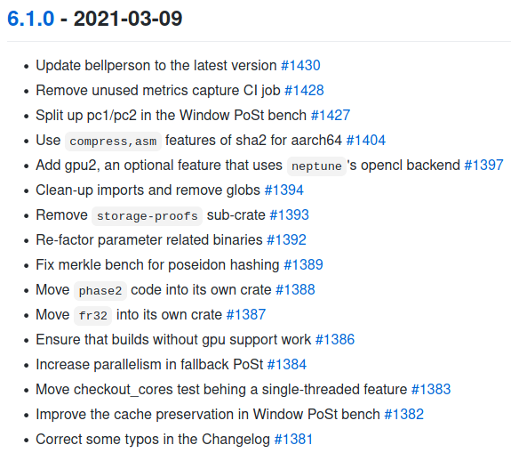

---
# Blog post title
title: "CryptoComputeLab announces proofs release 6.1.0"

# Website post date
# format YYYY-MM-DD
date: 2021-03-22

# Publish from this date (defaults to date)
# publishDate: 2019-09-03

# For PL authors, use author folder name; for non-PL authors, write name as in paper within ""
# We sort authors alphabetically by last name
authors:
  - nemo
  - volker-mische

# If applicable
categories:
  - blog

# Zero or more of the areas in content/areas
areas:
  - cryptography

# Zero or more of the groups in content/groups (should match author membership)
groups:
  - cryptocomputelab

# Not used
draft: false

---

Today we're proud to announce the recent release of
**[rust-fil-proofs](https://github.com/filecoin-project/rust-fil-proofs)
v6.1.0**. This release contains a number of significant re-factors and
performance optimizations, but we'd like to dig deeper into a couple of
them and show some of the real-world impacts.

But first, *in the realm of security,* this release ships with
**[blst](https://github.com/supranational/blst) v3.3.0** as an
optional [BLS12-381 pairing operation
backend](https://medium.com/supranational/introducing-blst-2b6a988d68ee),
which is an alternative to the previous and still currently default
[**pairing**](https://github.com/filecoin-project/paired)
backend. Most notably, this specific version of
[**blst**](https://github.com/supranational/blst) has been
audited for security and in the future we intend to use it as the
default backend for all BLS12-381 pairing operations in proofs. The
proofs code actually incorporates
[**blst**](https://github.com/supranational/blst) via
[blstrs](https://github.com/filecoin-project/blstrs/), a *Rust*
library wrapper, and this release updates from **v0.1.3** to **v0.2.2**.
More on that below.

The latest **rust-fil-proofs v6.1.0** does a
number of significant re-organizations at the source code level. Several source directories have
been moved out into their own 'crate' (the name used for a *Rust*
package), including **phase2** and **fr32**, and all of the source code
got a once-over trying to remove so-called [glob
imports](https://drs.is/post/against-globs/), arguably a sloppy
style of importing modules that accrued over time.

For performance, this release increases performance in pairing
operations via
[blstrs](https://github.com/filecoin-project/blstrs/), improves
parallelism in both
[PoSt](https://en.wikipedia.org/wiki/Proof_of_space#Proof_of_space-time)
[proving and
verification](https://github.com/filecoin-project/rust-fil-proofs/pull/1384)
and optionally allows access to
[neptune](https://github.com/filecoin-project/neptune)'s improved
[OpenCL](https://en.wikipedia.org/wiki/OpenCL) backend.
Benchmarking within the updated
[blstrs](https://github.com/filecoin-project/blstrs/) library
alone shows optimized performance in two key operations: *g1/g2 multiply*
and *fp12* *inverse*. A performance comparison between
the previous version and the latest one is shown below:

<table>
<thead>
<tr class="header">
<th><strong>Operation</strong></th>
<th><strong>Blstrs v0.1.3 (nanoseconds)</strong></th>
<th><strong>Blstrs v0.2.2 (nanoseconds)</strong></th>
<th><strong>Speed-up</strong></th>
</tr>
</thead>
<tbody>
<tr class="odd">
<td>G1 multiply</td>
<td>102,865</td>
<td>79,089</td>
<td>1.3x</td>
</tr>
<tr class="even">
<td>G2 multiply</td>
<td>252,315</td>
<td>180,283</td>
<td>1.4x</td>
</tr>
<tr class="odd">
<td>FP12 Inverse</td>
<td>9,314</td>
<td>5,520</td>
<td>1.7x</td>
</tr>
</tbody>
</table>

Switching gears, by default, the proofs code uses
[neptune](https://github.com/filecoin-project/neptune)'s gpu
backend, which accelerates the *Pre-commit Phase 2* stage of sealing by
building merkle trees efficiently on the GPU. This code has served
proofs well for some time and is a significant performance leap ahead of building those same trees
on modern CPUs. However, the GPU code itself inside of
[neptune](https://github.com/filecoin-project/neptune) has been
updated significantly and now includes a pure
[OpenCL](https://en.wikipedia.org/wiki/OpenCL) based
implementation to do that same tree building even more efficiently. For
the sake of this article, we'll describe the legacy/default tree
building as ***gpu*** and the new optional feature as ***gpu2***. With
this release, you can use this feature today by compiling
[rust-fil-proofs](https://github.com/filecoin-project/rust-fil-proofs)
with the ***gpu2*** feature. The only reason the new ***gpu2*** feature
remains optional at this time is because we would like to see wider
testing with it before making it the default -- though we don't expect
it'll be optional for too much longer. That said, let's dive into some
comparisons of the two and see what kind of impact we're looking at!

For the testing hardware, we have an [AMD Ryzen 9 3950X 16-core
processor](https://www.cpubenchmark.net/cpu.php?cpu=AMD+Ryzen+9+3950X&id=3598)
(32 threads) with 128GiB RAM and a [Nvidia GeForce RTX 2080
Ti](https://www.nvidia.com/en-us/geforce/graphics-cards/rtx-2080-ti/)
Rev. A GPU. For the test setup, we are using the [window
post](https://github.com/filecoin-project/rust-fil-proofs/#window-post-bench-usages)
benchmark included in the proofs code base for measurements. This
release allows us to configure this specific test to skip all of the
steps of sealing, and instead
[isolate](https://github.com/filecoin-project/rust-fil-proofs/pull/1427)
the 'Precommit Phase 2' stage of sealing, which is primarily the tree
building. Enabling this feature allows us to better benchmark GPU work
so that we can have an apples to apples comparison on the performance.

The proofs team is happy to share that the results of this testing are
very promising!

The image above summarizes our findings, which takes a look at wall
clock time for GPU tree building. The tested feature combinations are
with ***blst*** and ***gpu*** enabled, with ***pairing*** and ***gpu***
enabled, with ***blst*** and ***gpu2*** enabled, and finally with
***pairing*** and ***gpu2*** enabled. Lower wall clock time is better.

The specific times below are listed for each of the features enabled at
the time of the test run. The times recorded are in milliseconds. Both
CPU and wall time are shown, but they may vary depending on the specific
CPU and GPU used.

<table>
<thead>
<tr class="header">
<th><strong>Features enabled</strong></th>
<th><strong>CPU time (milliseconds)</strong></th>
<th><strong>Wall time (milliseconds)</strong></th>
</tr>
</thead>
<tbody>
<tr class="odd">
<td>Pairing and gpu</td>
<td>2,647,533</td>
<td>1,281,010</td>
</tr>
<tr class="even">
<td>Pairing and gpu2</td>
<td>3,338,394</td>
<td>687,922</td>
</tr>
<tr class="odd">
<td>Blst and gpu</td>
<td>2,660,596</td>
<td>1,261,724</td>
</tr>
<tr class="even">
<td>Blst and gpu2</td>
<td>5,390,836</td>
<td>696,688</td>
</tr>
</tbody>
</table>

Another notable improvement included in this release is an updated
version of the
[bellperson](https://github.com/filecoin-project/bellperson)
library (used for building our zk-SNARK circuits). This update allows
the large parameter files required to be loaded in parallel, which can
help both proving and verification times.

For the full list of changes, [click
here](https://github.com/filecoin-project/rust-fil-proofs/blob/master/CHANGELOG.md#610---2021-03-09)
or see below!

