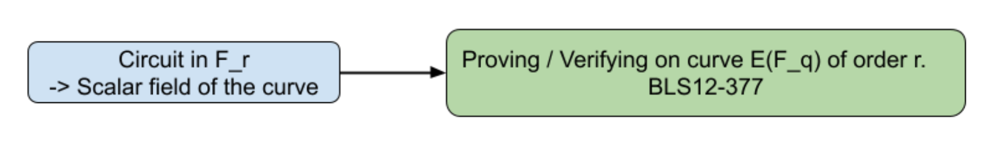
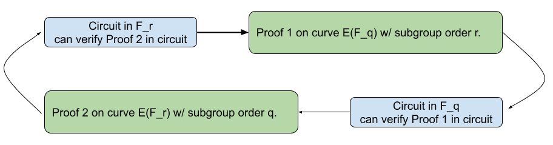
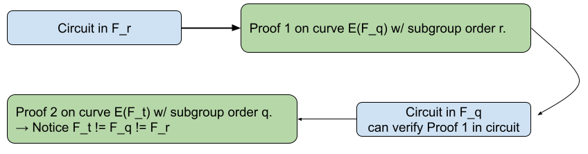
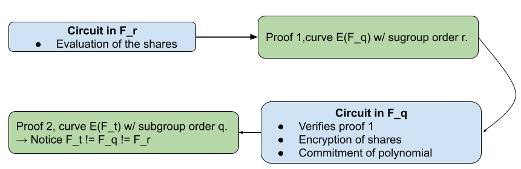
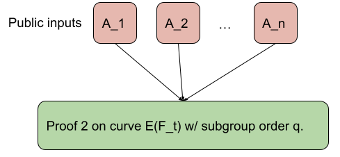
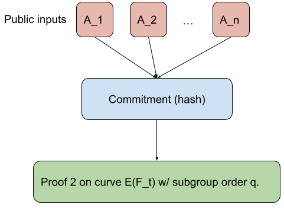
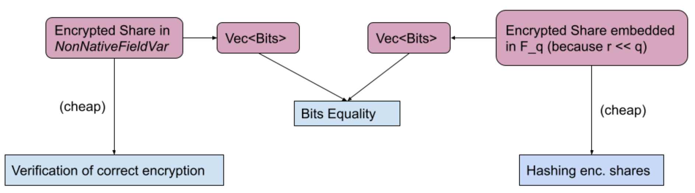

---
# Blog post title
title: "A deep dive into DKG, chain of SNARKs, and arkworks"

# Website post date
# format YYYY-MM-DD
date: 2022-06-06

# Publish from this date (defaults to date)
# publishDate: 2019-09-03

# For PL authors, use author folder name; for non-PL authors, write name as in paper within ""
# We sort authors alphabetically by last name
authors:
- nicolas-gailly

# If applicable
categories:
  - blog

# If applicable
tags:
  -

# Zero or more of the areas in content/areas
areas:
  - cryptography

# Zero or more of the groups in content/groups (should match author membership)
groups:
  - cryptonetlab

# Not used
draft: false

---

In this blog post I am going to share the main takeaways I have learned while implementing a proof of concept (PoC) of a Distributed Key Generation (DKG) inside of a SNARK. The idea is to implement the DKG operations inside a circuit later proven by a Groth16 zkSNARK using the [arkworks](https://github.com/arkworks-rs/) library and the BLS12-377 curve. This approach is able to produce a circuit to run a DKG for 800 participants that can be verified in 18ms (assuming some data availability layer).

This post contains details on the DKG and the circuit itself, but also discusses the problems/obstacles encountered along the way, some specificities of the arkworks library and (some of) their solutions. Treat this post as a means to share the knowledge learned during this exploration.

**Table of Contents**



## Notation

We need to settle on a common notation framework to start the exploration. Some of it will be explained in more detail along the post.
* Let us assume we have $n$ parties, each with a public key $PK_i \in E$
* We will call the threshold $t$
* We will work over an elliptic curve $E(F_q)$ defined over $F_q$
    * To do point operations (add, neg, ...), we need to operate with field elements $F_q$
* We call the prime order subgroup $F_r$ of order $r$
* We call the generator $G \in E(F_q)$ of the prime order subgroup
* We will work both in affine coordinates where we denote point $(x,y) \in F_q^2$
and in projective coordinates where we denote point $(x,y,z) \in F_q^3$
* We use the additive notation: scalar multiplication between scalar $a$ and point $G$ is noted $aG$
* We will also use a second elliptic curve $E'(F_p)$ defined over $F_p$ with prime order subgroup of order $F_q$


## Distributed Key Generation (DKG)

DKG is a core component of [threshold cryptography](https://en.wikipedia.org/wiki/Threshold_cryptosystem).
In general, DKG is an important tool to *decentralize* many Web3 cryptographic protocols. In particular, it allows multiple nodes to create a distributed key that nobody controls directly: only a _threshold_ of nodes that collaborate can make use of the distributed key.
[Drand](https://drand.love/), for example, uses DKG to produce BLS signatures (on pairing-equipped elliptic curves) to generate unbiasable and publicly verifiable randomness. [Axelar](https://axelar.network/), a recent cross-chain bridge, uses distributed keys to hold funds across different chains.

The most simple DKG is the Joint-Feldman protocol. The basis of this protocol is in the Verifiable Secret Sharing (VSS) scheme.

### Verifiable Secret Sharing (VSS)

[VSS](https://link.springer.com/referenceworkentry/10.1007%2F0-387-23483-7_452) is the basis for running the most simple DKG, the Joint-Feldman DKG, described in Figure 1 [here](https://link.springer.com/content/pdf/10.1007%2F3-540-48910-X_21.pdf).
The proposed DKG is basically $n$ executions of VSS  in parallel. At the end of the protocol, each party has $n$ shares they aggregate to produce their final share.

#### Overview of the VSS protocol

A special node called the *dealer* runs the following protocol:
1. **Random Secret Polynomial**: Node creates first random coefficients
    * $f(x) = a_1 + a_2 * x + ... + a_t * x^t$
2. **Share Evaluations**: Node evaluates the polynomial at all $n$ points
    * $s_1 = f(1), s_2 = f(2), ..., s_n = f(n)$
3. **Share Encryption**: Node encrypts the shares via a hashed variant of [ElGamal encryption](https://en.wikipedia.org/wiki/ElGamal_encryption)
    * $c_i = \{rG, H(rPK_i) + s_i\} \in (E,F_r)$
4. **Polynomial commitment**: Node uses the [Pedersen commitment](https://en.wikipedia.org/wiki/Commitment_scheme) to the polynomial
    * $A_1 = a_1G, ..., A_n = a_nG$
    * Note: we write the committed polynomial $F(x) = f(x)G$

Each party $j \neq i$ will then verify the correctness of their share:
1. **Decryption of the share**: Node $j$ decrypts the corresponding share $s_j$ using its private key
2. **Consistency check**: Node $j$ verifies that its share is consistent with the polynomial by checking $s_jG == F(j)$

Note that this is an informal description and different schemes can be used, especially for the encryption protocol.

#### DKG Protocol

The Joint-Feldman DKG is simply an application of VSS where each node independently runs a VSS protocol with every other node. However, we need to add **interactive rounds** to make sure the nodes agree on the final distributed key.

1. **Deal Phase**: Each node $i$ runs an independent VSS protocol as a dealer
2. **Complaint Phase**: Each node $j$ runs the consistency check on all the shares he received from each node. If there is one check that fails, the node issues a formal complaint broadcasting the share it received
3. **Justification Phase**: The node designated by the complaint must reveal a correct share for the node $j$ or be disqualifed

At the end of the process, the nodes _add_ their shares together to create a final distributed share of a secret key nobody knows:
* Share of node $i$ : $s_i = \sum_j s_{j,i}$ (sum of all shares it received from non-disqualified nodes)
* Distributed public key $P = \sum_j A_{j,1}$ (sum of all free coefficients)

The shares can then be combined to perform decryption or signatures. For more details about the DKG, we refer you to the [paper](https://link.springer.com/article/10.1007/s00145-006-0347-3) that explains it best.

### Going from interactive to non-interactive using SNARKs

The reason why this protocol is interactive is because the verifier needs to verify **the share has been encrypted correctly**.
There exist some verifiable encryption schemes that have been used to create non-interactive DKGs, for instance the [Fouque-Stern DKG](https://rustrepo.com/repo/ZenGo-X-fs-dkr). Such schemes provide a proof that the encrypted message (the share) $s_j$ is indeed the discrete log of $F(j)$.

However, the Fouque-Stern DKG scheme relies on a factoring assumption similar to the one the RSA system uses and incurs a quadratic cost per verifier. Indeed, each verifier must check that _all_ shares are correctly encrypted.

**Going noninteractive**. This is where a Succing Noninteractive ARgument of Knowledge (SNARK) can play a role. Informally, the prover expresses a certain computation as an arithmetic circuit, executes this computation, and produces a succinct proof (SNARK) so that the verifier only needs to verify a small proof and is guaranteed the prover correctly computed the computation. Please visit this [zcash blog post](https://z.cash/technology/zksnarks/) for a more  detailled introduction to SNARKs. From now on, this post will assume you have some degree of familiarity with zkSNARKs.

In our application, the dealer can perform all the DKG steps and produces a SNARK out of these computations so that the verifier can verify that all shares have been encrypted correctly.

## Overall system design

In this section, we will go over each operation (share evaluation, share encryption and polynomial commitment) and we will see how they translate into a SNARK circuit and what problems arise along the way.

### Fields and proofs

For this PoC, we selected the [Groth16 proof system](https://eprint.iacr.org/2016/260.pdf) and, as such, we will describe the computation in terms of [R1CS constraints](https://medium.com/@VitalikButerin/quadratic-arithmetic-programs-from-zero-to-hero-f6d558cea649). We chose to use the BLS12-377 curve because it is equiped with pairing operations (as required by Groth16) and also has has other interesting properties that will be useful later on.. Below is a high-level description of the relation between the *scalar field* and the *curve of the proof* where $r$ is the prime order of the subgroup we use in the BLS12-377 curve and $F_q$ is the field over which the points are defined in this curve.




### Share evaluation

Shares lie in $F_r$ so we need to use the pairing curve $E(F_q)$ to prove and verify the SNARK. **The circuit is described as constraints between elements lying in $F_r$**.

The circuit here is pretty simple:
* **Input**
    * Coefficients $a_1,..., a_n$
    * Indices $1,...,n$
    * Shares $s_1,...,s_n$
* **Circuit**
    * For each index $i:1\rightarrow n$:
        * Evaluate the polynomial designated by the coefficients at point $i$
        * Constrain the result to be equal to the $s_i$ share

Note: there is no notion of public or private (witness) input, for the sake of simplicity.

Now let's see how to execute the polynomial commitment phase that deals with points on $E(F_q)$.

### Elliptic-curve operations in circuit

**Problem**: We need to deal with **points on $E(F_q)$**, the committed coefficients, but so far the constraints are in $F_r$.

There are a few different ways of tackling this problem. We can use non-native arithmetic, we can use a cycle of curves, or we can use a 2-chain of pairing curves, i.e. a chain of pairing curves of length 2. Let's explore each one in more detail.

#### Non-native arithmetic

This solution proposes to do arithmetic in $F_q$ using elements in $F_r$. How this works, roughly, is that you represent elements in $F_q$ as limbs of elements in $F_r$, perform the operation between the limbs, and then compute the modulo reduction $q$ on the result.  For an in-depth exploration of these techniques, please have a look at arkworks' [implementation](https://github.com/arkworks-rs/r1cs-std/blob/1cf947c7615fd8ba169c4be9a203cce18e64a6ad/src/fields/nonnative/mod.rs).

**Why didn't I pick this approach?** This approach is extremely costly --- in general, a 1 to 2 order of magnitude more than native operations. Given that the amount of operations the circuit needs to perform in $F_q$ is *linear* in the number of participants, this would quickly become a bottleneck in our proof.

#### Cycle of curves

It is possible to create two elliptic curves related to each other in the following way:
* $E_1(F_q)$ with subgroup of order $r$
* $E_2(F_r)$ with subgroup of order $q$

With these curves, one can write a circuit in $F_r$ using the first curve, produce a proof, **and verify this proof in circuit** using the second curve $E_2(F_r)$. Indeed, verifying a proof often involves point operations (depending on the proof system), thus being able to natively express the verification algorithm in a circuit makes the recursive approach very viable.
For more information about recursive curves, have a look at the [PCD paper](https://eprint.iacr.org/2020/499) from Bunz et al. and at more recent techniques like [Nova](https://eprint.iacr.org/2021/370.pdf).



**Why didn't I pick this approach?** Cycles of curves for regular elliptic curves exist, and proof systems using them start to emerge. However, for this PoC, we wanted the outcome of the DKG to use a pairing-based curve (so we can use BLS signatures, for example). Unfortunately, cycles of pairing-based curves --- called [MNT curves](https://arxiv.org/abs/1803.02067) --- are very costly, the fields are very large and thus computations are much slower, and proofs bigger.

#### 2-chain of pairing curves

You can think of them as a "half" cycle; we have two pairings, but only one curve is defined over the other:
* $E_1(F_q)$ with subgroup of order $r$
* $E_2(F_r)$ with subgroup of order $t$    <-- Notice the different order

roach allows us to write a circuit in $F_t$, make a proof using $E_2(F_r)$ and write a verifier of the proof in a circuit over $F_r$. This means we would be able to verify the proof in circuit, using $E_1(F_q)$!
It turns out there are **efficient options within the 2-chain approach** that support this kind of 1 level recursion; one is the pair BLS12-377/BW6, described in [this](https://eprint.iacr.org/2021/1359.pdf) paper from El Housni et al.



**The 2-chain approach is best suited for this PoC** because it gives us what we need: the ability to express circuits in $F_r$ and $F_q$ while maintaining a relatively good level of performance compared to a full cycle of pairing curves.

### Layers of proofs

We now have two proofs to generate:
* One proof whose circuit performs the following operations on $F_r$
    * Polynomial evaluation (share creation)
* One proof whose circuit performs the following operations on $F_q$
    * Polynomial commitment
    * Encryption of the share
    * Verification of the second proof





Notice that the verifier *only verifies the final proof* (proof 2 in the diagram).

### Point representation

Before proceeding with the rest of the system design, it's important to detail how a point is represented in a circuit. There are two main forms of denoting a point on an elliptic curve:
* Affine form, two coordinates $(x,y) \in F_q^2$. This is the form most often used for serialization and pairings.
* Projective form, three coordinates $(x,y,z) \in F_q^{3}$. This is the form most often used for the actual group operations as computation in this form avoids some expensive computations such as inverses.

Arkworks supports both forms *in circuit* (see [here](https://github.com/arkworks-rs/r1cs-std/blob/master/src/groups/curves/short_weierstrass/mod.rs#L32) the implementation for short Weierstrass curves, a type of BLS12-377 curve). For reasons that will be explained furter ahead, our PoC uses the projective form.


### Polynomial commitment

Using this paradigm, we can now easily express the circuit that performs the polynomial commitment.

**Inputs**:
* Coefficients $a_1,...,a_n \in F_r^{n}$
* Public coefficients $A_1,...,A_n \in F_q^{3*n}$ --- remember that these are points on $E(F_q)$

**Circuit**:
* For each i in 1->n:
    * Transform $a_i$ into a sequence of Boolean variables (bits)
    * Compute scalar multiplication $a_iG$
    * Enforce result to be equal to $A_i$ (constrain coordinates to be equal)

The scalar multiplication algorithm can be found [here](https://github.com/arkworks-rs/r1cs-std/blob/master/src/groups/curves/short_weierstrass/mod.rs#L485).


### Share encryption

The encryption is stated as:
$$
$c_i = \{rG, H(rPK_i) + s_i\} \in (E(F_q),F_r)$
$$
For the hash function, we use arkworks' [Poseidon implementation](https://github.com/arkworks-rs/sponge). A possible optimization, and one that we implemented, is to reuse the same random element $rG$ in the entire encryption. This avoids one linear operation inside the circuit. Normally, one would never reuse a randomness, but in this case, since the dealer creates the different ciphertexts, it's okay as long as he can extract both ciphertexts. As for recipients, it's highly unlikely to have a collision between two $rPK_i$ and $rPK_j$ given the same $r$ and $PK_i \neq PK_j$.

As you can see, in this step, we need to perform operations on both $F_q$ *and* $F_r$.


#### Using the subproof?

We could delegate the operation in $F_r$ to the subproof, responsible for share evaluation, but in this case using non-native arithmetic is strictly better. Indeed, there is a cost to verifying a Groth16 proof inside another one: the verifying circuit needs to encode the public inputs correctly, and one scalar multiplication is performed for each such public input. This means we would need to give $H(r_PK_i)$, $s_i$ and $H(rPK_i) + s_i$ as public inputs to verify the addition has been made correctly, which in turn corresponds to three scalar multiplications in the order of hundreds of constraints for each (depending on the curve, etc.).

#### Using non-native arithmetic

For this scenario, it's much simpler and more efficient to merely emulate one addition on $F_r$ over $F_q$. That is what the code does [here](https://github.com/nikkolasg/ark-dkg/blob/main/src/encrypt.rs#L166). However, since we require the output of the hash function to be a $F_r$ element while the circuit is still on $F_q$, arkworks is doing a lot behind the scenes to return that outpout. See the next section for more details.

### Reducing public inputs

To verify a Groth16 proof, one needs to do a multiscalar multiplication between the public inputs ($a_i$) and some verification key bases ($G_i$).
$$
a_1G_1 + a_2G_2 + ... + a_nG_n
$$
Naively, the public inputs to give to the verification routine would be:
* All encrypted shares
* All the committed coefficients

In other words, the **public inputs are linear in the number of participants**. That means the verifier needs to do a linear size multiscalar multiplication! This hinders the scalability of the system.

**Committing to the inputs**. A simple way to get faster verification is to:
* Commit to all the public inputs using, for example, a hash function (in our case, this would be Poseidon as we need fast opening in circuit)
* Give the commitment to the Groth16 proof so there is only one public input
* Have the circuit take as witnesses all the encrypted shares and committed coefficients and *recompute the commitment* inside the circuit

In short, we pass from this:




To a *single* public input to the proof:



[Here](https://github.com/nikkolasg/ark-dkg/blob/main/src/dkg.rs#L165) is the relevant code for the commitment part.

**Hiding the public inputs**. The verifier still needs to get the commitment in the first place. Either he trusts the prover, or he recomputes the committment, natively, from scratch from all the encrypted shares and committed coefficients. While the latter forces the verifier to be linear again, the former introduces the problem of knowing that the public inputs are indeed available. Simply put, it requires the same guarantee that rollups require today: *data availability* (more on this in the [Future Work section](#future-work)).

## Arkworks/circuit specificities

In this section I'll discuss specific problems and challenges I've encountered during the implementation. I'll also share what I learned from this deep dive into the arkworks ecosystem.

### Poseidon hashing & non-native arithmetic

As we discussed in the previous sections, the encryption of the share is done in a circuit over $F_q$ but we actually manipulate an $F_r$ element out of the hash function. Arkworks provides this functionality via the [`squeeze_nonnative_field_elements`](https://github.com/arkworks-rs/sponge/blob/c9f7d24a5f10c415e9370a079cb060d95400b938/src/constraints/mod.rs#L122) method. Essentially what this method does is to:
* Take $F_q$ elements as outputs as usual ([code](https://github.com/arkworks-rs/sponge/blob/c9f7d24a5f10c415e9370a079cb060d95400b938/src/poseidon/constraints.rs#L254)).
* Convert these elements into a list of Boolean variables: $F_q$ elements that are only 0 or 1 ([code](https://github.com/arkworks-rs/sponge/blob/c9f7d24a5f10c415e9370a079cb060d95400b938/src/poseidon/constraints.rs#L258)).
* Interpret these as bit representations of an $F_r$ element (each one represented as a limb of $F_q$ elements). You can find the code [here](https://github.com/arkworks-rs/sponge/blob/c9f7d24a5f10c415e9370a079cb060d95400b938/src/constraints/mod.rs#L19) although this part is way more involved.

### Curve interfaces in circuit vs native

Arkworks has made a huge effort to standardize interfaces for dealing with fields and group operations on elliptic curves. These interfaces are invaluable to easily switch between curves, implementations and algorithms. The library also tries to provide the equivalent of this in the "circuit" world. Nonetheless, there are subtle differences between the native and the circuit interfaces, which forces some design choices on you.

Let's look at a simplified version of the pairing [interface](https://github.com/arkworks-rs/algebra/blob/master/ec/src/lib.rs#L53-L79) so that we can discuss some high-level differences:

```rust {linenos=table}
pub trait PairingEngine  {
    /// This is the scalar field of the G1/G2 groups.
    type Fr: PrimeField + SquareRootField;

    /// The projective representation of an element in G1.
    type G1Projective: ProjectiveCurve<BaseField = Self::Fq, ScalarField = Self::Fr, Affine = Self::G1Affine>

    /// The affine representation of an element in G1.
    type G1Affine: AffineCurve<BaseField = Self::Fq, ScalarField = Self::Fr, Projective = Self::G1Projective>

    /// The projective representation of an element in G2.
    type G2Projective: ProjectiveCurve<BaseField = Self::Fqe, ScalarField = Self::Fr, Affine = Self::G2Affine>

    /// The affine representation of an element in G2.
    type G2Affine: AffineCurve<BaseField = Self::Fqe, ScalarField = Self::Fr, Projective = Self::G2Projective>
```

As you can see, we have access to both the **projective** form --- a point is represented by three coordinates $(x,y,z) \in F_q^3$ --- and the **affine** form --- a point is represented by two coordinates $(x,y) \in F_q^2$. The former is often used for the group operations (addition of points, etc.), whereas the latter is used more frequently for serialization and pairing operations. However, the "circuit-facing" pairing [interface](https://github.com/arkworks-rs/r1cs-std/blob/master/src/pairing/mod.rs#L16) is slightly different:

```rust {linenos=table}
pub trait PairingVar<E: PairingEngine, ConstraintF: Field = <E as PairingEngine>::Fq> {
    /// An variable representing an element of `G1`.
    /// This is the R1CS equivalent of `E::G1Projective`.
    type G1Var: CurveVar<E::G1Projective, ConstraintF>
        + AllocVar<E::G1Projective, ConstraintF>
        + AllocVar<E::G1Affine, ConstraintF>;

    /// An variable representing an element of `G2`.
    /// This is the R1CS equivalent of `E::G2Projective`.
    type G2Var: CurveVar<E::G2Projective, ConstraintF>
        + AllocVar<E::G2Projective, ConstraintF>
        + AllocVar<E::G2Affine, ConstraintF>;

    /// An variable representing an element of `GT`.
    /// This is the R1CS equivalent of `E::GT`.
    type GTVar: FieldVar<E::Fqk, ConstraintF>;
}   
```

Here, the pairing interface only exposes the projective form of the points, `CurveVar`.

You could say "so what?" and you'd be right --- except that, for this particular PoC, this led to specific choices of operations. Read on to the next sections to find out why!

### Points as public inputs

The first inconvenience is that it forces you to expore points as three coordinates, i.e. three circuit variables. For points expressed as public inputs of the circuit, that means the verifier will have to perform 3 scalar multiplication per point. If points were expressed in affine coordinates, verifier would only need to perform two scalar multiplications per points. On the other hand, the prover would have to convert in circuit the points to projective coordinates. In our application, verifier time way more important than prover time and this would be one thing we could improve on.

### Hashing elliptic curve points

Remember the encryption scheme ?
$$
c_i = \{rG, H(rPK_i) + s_i\} \in (E(F_q),F_r)
$$

We need to hash a point in order to get some "non-native" $F_r$ as an output. The naive way to accomplish this would be to hash $(x,y)$ for an affine point. But we could also hash only the $x$ coordinate, because we know from the curve equation that for a given $x$ there are only two possible $y$'s, so the probability of finding a collision during the encryption is actually pretty rare (and checkable).

Unfortunately, because the circuit interface only exposes a projective point, we can't use the affine form. Thus, we need to hash $(x,y,z)$ entirely, which moderately increases the cost of hashing in the circuit. The change required to get there is actually pretty small (see [PR](https://github.com/arkworks-rs/algebra/pull/407)) so hopefully this will be lifted in future releases.

### Public inputs of the inner Groth16

The inner proof, the one that verifies the correct share evaluation, uses the inner curve, and thus **its public inputs are $F_r$ elements**. However, the circuit that verifies this proof **is defined over $F_q$**.

Here, again, arkworks will silently transform your $F_r$ public inputs into a list of Boolean variables over $F_q$ so as to perform the multiscalar multiplication. The code can be found [here](https://github.com/arkworks-rs/crypto-primitives/blob/main/src/snark/constraints.rs#L146) and is sometimes quite involved in order to pack, in a smart way, as compactly as possible, a bunch of $F_r$'s into $F_q$'s.

### Embedding $F_r$ into $F_q$

Remember that for the commitment of  the public inputs, the prover needs to hash them inside the circuit. Some of these inputs are $F_r$ elements, such as the encrypted share or the index at which to evaluate the circuit.

As it turns out, for BLS12-377 (the curve chosen), we can embed an $F_r$ element inside an $F_q$ element (since $r << q$) by first interpreting the bits of the $F_r$ elements as a $F_q$ element and then giving the latter as input.

```rust {linenos=table}
// Embed $F_r$ into $F_q$
let scalar_in_fq = &I::Fq::from_repr(
    <I::Fq as PrimeField>::BigInt::from_bits_le(
        &native.into_repr().to_bits_le(), // <-- native share to bits
)).unwrap(); // because Fr < Fq it always works
// Then treat this Fq element as a field var in circuit
let scalar_var = FpVar::new_input(ns!(cs.clone(), "scalar fq"), || Ok(scalar_in_fq))?;
```

This technique is used to embed the shares and the indices at which to evaluate the polynomials.

### Different equivalent representations of a field in a circuit

In the outer circuit, we represent the encrypted shares in $F_r$ as `NonNativeFieldVar` (i.e. as a set of $F_q$ elements), as we need that for the encryption. However, we will have to hash those encrypted shares later on.

To hash those, we could use the set of $F_q$ via the `NonNativeFieldVar::to_constraint_field` representation (i.e. a vector of $F_q$ that represents the $F_r$ element) but, unfortunately, arkworks doesn't support this operation *outside* the circuit. We would need to reimplement the non-native field var logic outside of the circuit logic, which was not a goal of this PoC.

As a workaround, for each encrypted share, the circuit performs a bit-decomposition method `to_bits_le`, so that we get 256 `BooleanVar`. We could then feed these directly into the hash function, but that would be very costly, because for each individually encrypted share $F_r$ we would need to hash 256 $F_q$ elements which are only 0 or 1, and each "hashing" may be between 300 and 500 constraints!

The solution to reduce the constraint used in this PoC is to:
* Use _another_ variable that directly embeds the encrypted shares into a single $F_q$ (again it's possible because $r << q$).
* Hash that variable so it's only one "absorbing" operation (instead of 256).
* Compare the bits representation of that variable to the bits representation of the `NonNativeFieldVar` --- this is still costly but much less so than the naive solution.



Reminder: verification of correct encryption needs non-native arithmetic and hashing needs embedding for performance.

**Implementation detail**: Note that, when comparing the bits between the two representations, we should compare only up to the size of $F_r$ and the rest *must* be zero to avoid validating any proofs with different witnesses.


## Benchmarks

Here are some basic benchmarks simulated on an AWS machine with 48 cores and 192GB of memory. The high memory requirement is mostly due to the local trusted setup.

The threshold is set each time at 50% of $n$. All benchmarks presented here are for only _one_ proof. A final system would have one proof *per* participant.
Here is a definition of the terms in the table below:
* **$n$** is the number of participants, i.e. the number of encrypted shares + evaluations performed in the circuit.
* **Outer constraints** is the number of constraints on the outer proof. The number of inner constraint is negligible (a maximum of 700k for 800 participants) and doesn't contribute much to the overall prover time.
* **Proving time** is the time it takes to make a proof, including the time it takes to generate the inner proof.
* **Verifying** is the time it takes to verify the Groth16 proof only.
* **Verifying time total** is the verifying time plus the time to compute the commitment from the individual pieces (encrypted shares, coefficients, etc.).

| n   | outer constraints | proving time  | verifying (ms) | verifying time total (ms) |
| --- | ----------------- | ----------------- | -------------- | -------------------- |
| 5   | 144093            | 6.8s              | 11             | 12                   |
| 50  | 1124907           | 40s             | 15             | 25                   |
| 100 | 2212532           | 76s             | 15             | 37                   |
| 500 | 10913532          | 6m            | 21             | 82                   |
| 800 | 17439282          | 10.5m            | 18             | 115                  |

You can find the repo [here](https://github.com/nikkolasg/ark-dkg) - please note this is highly experimental, and not a proper codebase ready for production!

## Future work

This PoC was put on pause as we explore other options. Nevertheless, there are multiple avenues that can be pursued to improve it and aspects of the design to tweak.

### Polynomial commitment using Schnorr-like proofs

Given that polynomial commitment schemes are discrete log commitments, we can use simple Schnorr-like proofs to express those.  

### Better hashing

Being able to only hash the $x$ coordinate of points would mean fewer constraints and less time spent by both prover and verifier.

### Unified representations

Being able to save on the different representations of the encrypted shares between `NonNativeFieldVar`, `Vec<Boolean<>>`, and `FpVar` would provide a large reduction in constraints. Furthermore, if we were able to reproduce the non-native arithmetic outside of the circuits, for example, it would help reduce the hashing constraints.

### Explore the full non-native option

Instead of using an inner Groth16, we could also do the evaluation of the polynomial directly "non-natively" in the outer circuit. From preliminary benchmarks, it looks like this would be 1 to 2 orders of magnitude more costly.

###  Polynomial commitment scheme with roots of unity

Instead of naively evaluating the polynomial at all indices in the inner proof, it might be cheaper to _verify_ an opening proof for all positions. This could be especially relevant when using a homomorphic scheme, which allows us to aggregate opening proofs together so there would be only one proof to verify for all indices. That, in combination with using roots of unity, may provide efficient (short) computation in $F_r$ world and more computation in $F_q$ world, perhaps avoiding the cost of doing an inner proof at all. See [fast KZG proofs](https://alinush.github.io/2021/06/17/Feist-Khovratovich-technique-for-computing-KZG-proofs-fast.html) and the appendix of [Halo Infinite](https://eprint.iacr.org/2020/1536) for more directions.

### DKG system with aggregation

This PoC is only one piece of the puzzle (the biggest though). Eventually, _every_ participant will generate and post such a proof. Where are these proofs posted? Who verifies? And, more importantly, can we use another proof that attests the correct verification of all these proofs such that the cost to verify on-chain is constant? How fast would aggregating these proofs using [SnarkPack](https://eprint.iacr.org/2021/529) be? How do we ensure data availability in this context?

## Acknowledgments

Thanks to Kobi Gurkan and Youssef El Housni for the initial discussions about this approach. Thanks to Weikeng Chen for his invaluable support on the arkworks library; I asked a lot of questions but he was always happy to answer them. Thanks to Barbara Soares and Yolan Romailler for review and help on this post.

*Nicolas Gailly is a member of the [Cryptonet](/groups/cryptonetlab) team at Protocol Labs.*
